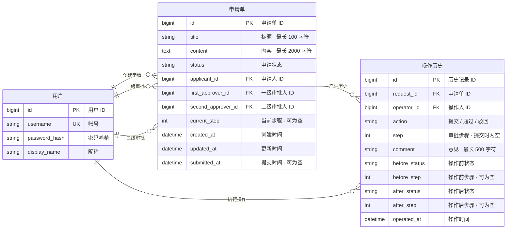

```mermaid
erDiagram
    direction LR

    USER["用户"] {
        bigint id PK "用户 ID"
        string username UK "账号"
        string password_hash "密码哈希"
        string display_name "昵称"
    }

    APPROVAL_REQUEST["申请单"] {
        bigint id PK "申请单 ID"
        string title "标题 · 最长 100 字符"
        text content "内容 · 最长 2000 字符"
        string status "申请状态"
        bigint applicant_id FK "申请人 ID"
        bigint first_approver_id FK "一级审批人 ID"
        bigint second_approver_id FK "二级审批人 ID"
        int current_step "当前步骤 · 可为空"
        datetime created_at "创建时间"
        datetime updated_at "更新时间"
        datetime submitted_at "提交时间 · 可为空"
    }

    OPERATION_HISTORY["操作历史"] {
        bigint id PK "历史记录 ID"
        bigint request_id FK "申请单 ID"
        bigint operator_id FK "操作人 ID"
        string action "提交 / 通过 / 驳回"
        int step "审批步骤 · 提交时为空"
        string comment "意见 · 最长 500 字符"
        string before_status "操作前状态"
        int before_step "操作前步骤 · 可为空"
        string after_status "操作后状态"
        int after_step "操作后步骤 · 可为空"
        datetime operated_at "操作时间"
    }

    USER ||--o{ APPROVAL_REQUEST : "创建申请"
    USER ||--o{ APPROVAL_REQUEST : "一级审批"
    USER ||--o{ APPROVAL_REQUEST : "二级审批"
    APPROVAL_REQUEST ||--o{ OPERATION_HISTORY : "产生历史"
    USER ||--o{ OPERATION_HISTORY : "执行操作"
```
